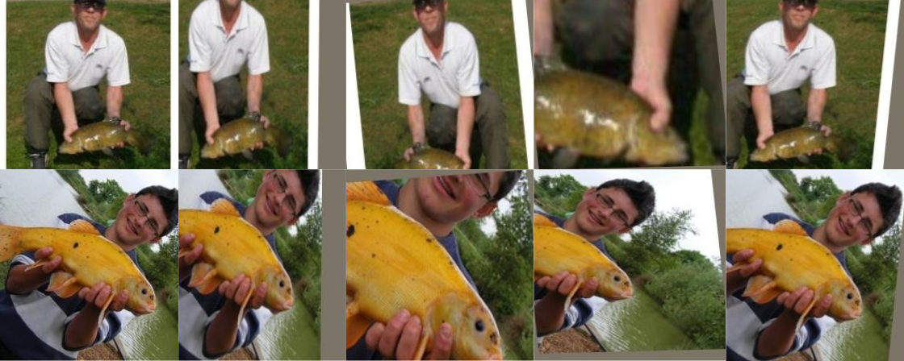

[](https://opensource.org/licenses/Apache-2.0)



# DABO: Data Augmentation with Bilevel Optimization  [[Paper]](https://arxiv.org/pdf/2006.14699.pdf)
The goal is to automatically learn an efficient data augmentation regime for image classification.


## Table of Contents

- [Overview](#overview)
- [Experiments](#experiments)
- [Citation](#citation)

## Overview

<b>What's new:</b> DABO this method

<b>Key insight:</b>

<b>How it works:</b>

<b>Results:</b>

<b>Why it matters:</b> Proper data augmentation can significantly improve generalization performance. Unfortunately, deriving these augmentations require domain expertise or extensive hyper-parameter search. Thus, having an automatic and quick way of identifying

<b>Where to go from here:</b>


## Experiments

<b>1. Install requirements:</b> Run this command to install the Haven library which helps in managing experiments.

```
pip install -r requirements.txt
``` 


<b>2. CIFAR10 experiments:</b> The followng command runs the training and validation loop for CIFAR.

```
python trainval.py -e cifar -sb ../results -d ../data -r 1
```

where `-e` defines the experiment group, `-sb` is the result directory, and `-d` is the dataset directory.


<b>3. Results:</b> Launch Jupyter by running the following on terminal,

```
jupyter nbextension enable --py widgetsnbextension
jupyter notebook
```

Then, run the following script on a Jupyter cell,
```python
from haven import haven_jupyter as hj
from haven import haven_results as hr
from haven import haven_utils as hu

# path to where the experiments got saved
savedir_base = '<path_to_savedir_base>'

# get experiments
rm = hr.ResultManager(exp_list=None, 
                      savedir_base=savedir_base, 
                      verbose=0
                     )
# launch dashboard
hj.get_dashboard(rm, vars(), wide_display=True)
```

## Citation

```
@article{mounsaveng2020learning,
  title={Learning Data Augmentation with Online Bilevel Optimization for Image Classification},
  author={Mounsaveng, Saypraseuth and Laradji, Issam and Ayed, Ismail Ben and Vazquez, David and Pedersoli, Marco},
  journal={arXiv preprint arXiv:2006.14699},
  year={2020}
}
```
