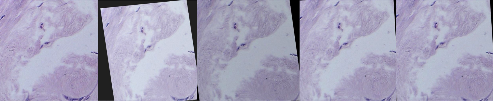
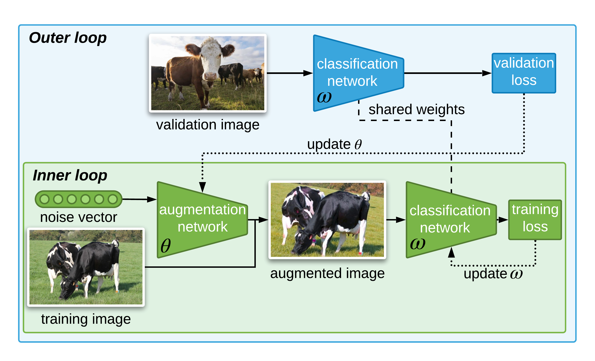

[](https://opensource.org/licenses/Apache-2.0)




# DABO: Data Augmentation with Bilevel Optimization  [[Paper]](https://arxiv.org/pdf/2006.14699.pdf)
The goal is to automatically learn an efficient data augmentation regime for image classification.


## Table of Contents

- [Overview](#overview)
- [Experiments](#experiments)
- [Citation](#citation)

## Overview

<b>What's new:</b> This method provides a way to learn automatically the best data augmentation jointly with an image classifier. It does not require a manual preselection of potentially useful transformations, which makes the method faster than those requiring an expensive validation loop for data augmentation selection and applicable to any datasets, especially those where predefining good data augmentation transformation is not trivial, like in medical imaging.

<b>Key insight:</b> Our method uses the gradient of the validation loss in a bilevel optimization framework to learn the best data augmentation parameters. To address the issue of the computational cost to resolve the bilevel optimization, we estimate the validation loss using truncated back-propagation.

<b>How it works:</b>




* For each mini batch,a forward pass is made to calculate the training loss.
* Based on the training loss and the gradient of the training loss, an optimization step is made for the classifier in the inner loop.
* A forward pass is then made on the classifier with the new weight to calculate the validation loss.
* Thanks to the shared weights of the classifier used to obtain the training and validation loss, the gradient of the validation loss is backpropagated to the augmenter network to train it.

<b>Results:</b> Our model obtains better results than carefuly hand defined transformations and GAN-based approach and close results to methods using a policy search on CIFAR10, CIFAR100, BACH, Tiny-Imagenet and Imagenet datasets.

<b>Why it matters:</b> Proper data augmentation can significantly improve generalization performance. Unfortunately, deriving these augmentations require domain expertise or extensive hyper-parameter search. Thus, having an automatic and quick way of identifying efficient data augmentation has a big impact in obtaining better models.

<b>Where to go from here:</b> Performance can be improved by extending the set of learned transformations to non-differentiable transformations. The estimation of the validation loss could also be improved by exploring more the influence of the number of iteration in the inner loop. Finally, the method can be extended to other tasks like object detection of image segmentation.


## Experiments

<b>1. Install requirements:</b> Run this command to install the Haven library which helps in managing experiments.

```
pip install -r requirements.txt
``` 


<b>2.1 CIFAR10 experiments:</b> The followng command runs the training and validation loop for CIFAR.

```
python trainval.py -e cifar -sb ../results -d ../data -r 1
```

where `-e` defines the experiment group, `-sb` is the result directory, and `-d` is the dataset directory.

<b>2.2 BACH experiments:</b> The followng command runs the training and validation loop on BACH dataset.

```
python trainval.py -e bach -sb ../results -d ../data -r 1
```

where `-e` defines the experiment group, `-sb` is the result directory, and `-d` is the dataset directory.


<b>3. Results:</b> Launch Jupyter by running the following on terminal,

```
jupyter nbextension enable --py widgetsnbextension
jupyter notebook
```

Then, run the following script on a Jupyter cell,
```python
from haven import haven_jupyter as hj
from haven import haven_results as hr
from haven import haven_utils as hu

# path to where the experiments got saved
savedir_base = '<path_to_savedir_base>'

# get experiments
rm = hr.ResultManager(exp_list=None, 
                      savedir_base=savedir_base, 
                      verbose=0
                     )
# launch dashboard
hj.get_dashboard(rm, vars(), wide_display=True)
```

## Citation

```
@article{mounsaveng2020learning,
  title={Learning Data Augmentation with Online Bilevel Optimization for Image Classification},
  author={Mounsaveng, Saypraseuth and Laradji, Issam and Ayed, Ismail Ben and Vazquez, David and Pedersoli, Marco},
  journal={arXiv preprint arXiv:2006.14699},
  year={2020}
}
```
